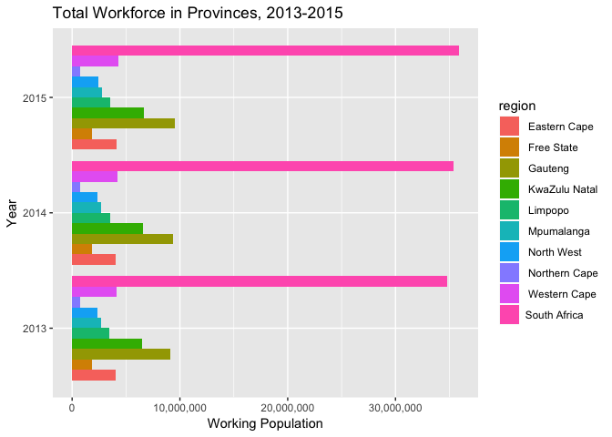

I created this script to practice wrangling and graphing. The code is based on what was otherwise accomplished in Excel and some online viz tool in [this handy little Medium article](https://medium.freecodecamp.org/data-journalism-isnt-for-the-select-let-s-work-out-a-story-together-from-scratch-dd85b3017f4a) by [Mina Demian](https://twitter.com/minademjan) for [Free Code Camp](https://medium.freecodecamp.org)

Here we go:

You're gonna wanna summon the following libraries

``` r
library(tidyr)  #for data manipulation
library(dplyr)  #for data manipulation
library(ggplot2)#for the plots
library(scales) #helps us do some rounding later
```

Just set up two custom functions to use later in an lapply and dplyr-chain One function to strip commas from input and then convert to numeric

``` r
conversion <- function(x){  
  as.numeric(gsub(",","", x)) 
}
```

And one to round the means up

``` r
round_means_up <- function(x){
  ceiling(mean(x))
}
```

Read the table I made of the data provided by the original author. (It's just a selection of employment data from subset from a multi-tabbed excel file)

``` r
data <- read.csv("sa-data.csv")
```

Now clean only the data you need cleaned

``` r
data[,2:11] <- lapply(data[,2:11], conversion)
```

Here's the dirty work. Basically, we're going to chop the date stamps into years, group the data by region, summarize the working population by getting the quarterly average for the year

``` r
data <- data %>%
  gather("quarter", "population", 2:11) %>%
  separate(quarter, into=c('x','y', 'year'), sep = "\\.") %>%
  group_by(region, year) %>%
  summarise(population = round_means_up(population))
```

Great. And now we paint the data into a horizontalized, clustered, prettily-colored bar graph using ggplot2

``` r
g <- ggplot(data, aes(x = year, y = population, fill=region)) + 
  geom_bar(stat = "identity", position = "dodge") + 
  xlab("Year") + ylab("Working Population") + 
  ggtitle("Total Workforce in Provinces, 2013-2015") +
  scale_y_continuous(breaks = seq(0, max(data$population), 10000000 ), labels = comma) +
  coord_flip()
```

Look at how pretty it is

``` r
g
```



Check out the repo: <https://github.com/talnoznisky/data-jour-101>
